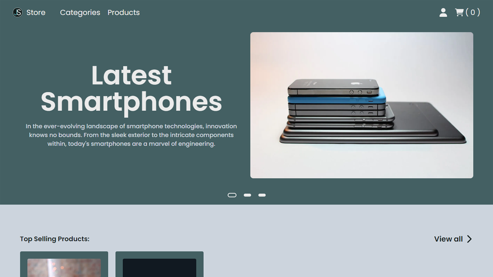

# João Silva

  
  
  

#

    &nbsp;
    &nbsp;
    &nbsp;
    

&nbsp;

    &nbsp;
    &nbsp;
    &nbsp;
    &nbsp;
    &nbsp;
    &nbsp;
    &nbsp;
    

&nbsp;

    &nbsp;
    

##

  
  
  
  

